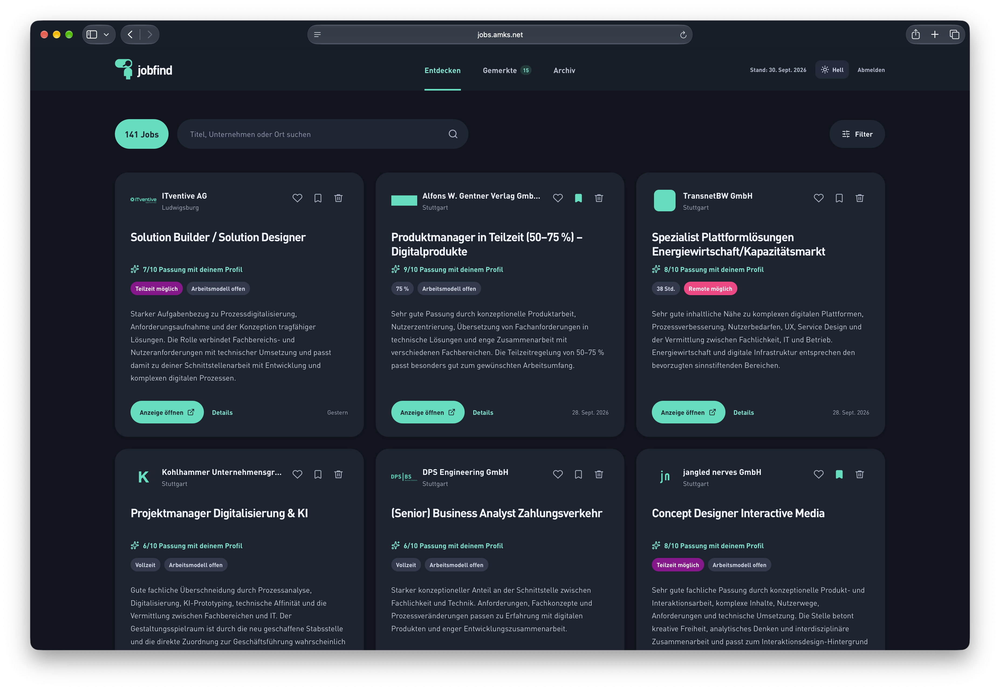
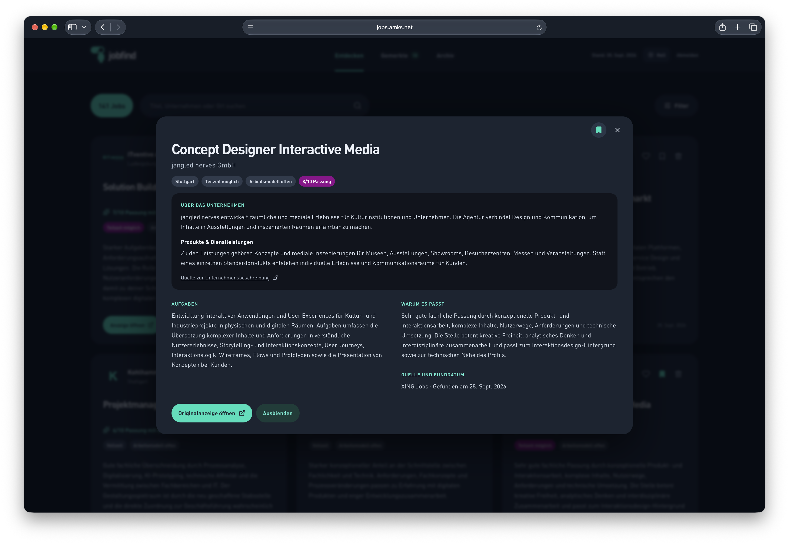

# Jobfind mit Hermes-Integration

[English documentation](README.md)

Die weiterführenden Dokumente unter `docs/` sind auf Englisch. Oberfläche,
CLI-Meldungen, Beispieldaten und erzeugter Suchkontext bleiben zunächst deutsch.

Jobfind ist eine schlanke, selbst gehostete Web-App für die persönliche Jobsuche.
Sie ist für eine einzelne Person gedacht, die wenige passende Stellen übersichtlich
prüfen und konkretes Feedback für den nächsten Suchlauf geben möchte.

Suchprofil und bisheriges Feedback → Hermes recherchiert → strukturierter Import →
Jobfind zeigt Stellen → Likes, Merken und Ablehnungsgründe → Kontext der nächsten Suche.
Die Rückkopplung passt den Suchkontext an; sie trainiert keine Modellgewichte.
Eine messbare Verbesserung der Trefferqualität oder Markt-Alleinstellung ist nicht belegt.

**Stand:** technisch vorbereitete erste Veröffentlichung unter MIT-Lizenz. Die vollständige
Browserprüfung und ein echter Hermes-Suchlauf sind noch offen. Es handelt sich um ein
Hermes-Erweiterungspaket mit dateibasierter Integration, nicht um ein offizielles Hermes-Plugin.

## Screenshots



*Stellen entdecken und ihre Passung mit dem Suchprofil vergleichen.*



*Unternehmen, Aufgaben und die Begründung der Passung im Detail prüfen.*

## Vorhandene Funktionen

- Übersicht, Textsuche, Filter für Arbeitsmodell, Arbeitszeit, Passung und ausgeblendete Stellen.
- Detailansicht, geprüfte HTTP(S)-Links zu Originalanzeigen und optionale Unternehmensporträts mit Quellen.
- Merken, unabhängige Likes, Ausblenden sowie Ablehnen mit mehreren Gründen und bis zu 600 Zeichen Notiz.
- Rückgängig für Ablehnungen in der geöffneten Sitzung, einschließlich vorherigem Status und Feedback.
- Import mit URL-/Quellen-ID-Deduplizierung, Laufidentität und konfigurierbarem Tageslimit.
- Lokale Offline-Kopie und geordnete spätere Synchronisierung von Nutzeraktionen.

Hermes übernimmt die automatische Recherche. Jobfind stellt Profil und Feedback-Kontext
bereit, validiert Ergebnisse und speichert Stellen und Nutzeraktionen in SQLite.
App, manueller Import und erfundene Demo funktionieren ohne Hermes.
Automatische Bewerbungen, Dokumentgeneratoren und Mehrmandantenbetrieb sind nicht enthalten.

## Voraussetzungen und geprüfte Umgebung

- Python **3.11 oder neuer**, inklusive `venv`, SQLite und Zeitzonendaten.
- Geprüft auf **macOS 27.0.1**, mit **Python 3.11.16 und 3.14.7**; SQLite des
  Haupt-Testlaufs: **3.53.4**. Keine Zusage für ungeprüfte Linux-, Windows- oder Docker-Umgebungen.
- Keine zusätzlichen Python-Pakete, kein npm und keine Build-Kette für den Betrieb.
  `requirements.txt` dokumentiert die leere Liste externer Python-Abhängigkeiten.
- Moderner Browser mit JavaScript. Offline benötigt IndexedDB, Service Worker und
  Cache Storage auf `localhost`/Loopback oder unter HTTPS; reale Browser noch manuell prüfen.
- Optional für automatische Recherche: eigenes eingerichtetes Hermes mit Modellanbieter
  und Recherchewerkzeugen. Lokaler Integrationsstand geprüft gegen **Hermes Agent v0.21.4
  (2026.9.21), Commit c80d12b9**. Geprüft wurden CLI-Hilfe und Quell-Schnittstellen,
  keine echte Suche. Hermes wird nicht mitgeliefert. [Integration](docs/HERMES.md).

## Installation und eigene Einrichtung

Das Projekt von GitHub klonen oder dort als ZIP herunterladen und auspacken:

```sh
git clone https://github.com/andreasmaks/Jobfind.git
cd Jobfind
```

Die folgenden Befehle im Projektordner ausführen. Python vorher installieren,
falls `python3 --version` keine geeignete Version zeigt.

```sh
python3 --version
python3 -m venv .venv
.venv/bin/python jobfind.py init
.venv/bin/python jobfind.py doctor
```

`init` erstellt `config/jobfind.json`, ohne vorhandene Dateien zu überschreiben.
Bearbeite darin dein Suchprofil und setze anschließend ein **eigenes Passwort**:

```sh
.venv/bin/python jobfind.py password
.venv/bin/python jobfind.py start
```

Die App ist standardmäßig unter **http://127.0.0.1:8123** auf demselben Rechner erreichbar.
Der Prozess läuft im Vordergrund; **Ctrl+C** stoppt ihn. `scripts/start_server.sh` ist
ein zusätzlicher Einstieg nach Erstellung der `.venv`. Es wird kein Hintergrunddienst,
Proxy oder öffentlicher Zugang installiert. Es gibt keine eingebauten Zugangsdaten.
Das Passwort muss 12–256 Zeichen haben; interaktiv wird es verdeckt zweimal abgefragt.
Ein Passwortwechsel beendet alle bestehenden Serversitzungen.

Andere Konfigurationen sind über `--config /pfad/zur/eigenen.json` **vor** dem Unterbefehl
oder `JOBFIND_CONFIG` möglich. Alte `JOBPORTAL_*`-Variablen werden nicht verwendet.

### Suchprofil

`config/example.json` enthält ausschließlich erfundene Orte und neutrale Wünsche.
Diese Angaben vor einer echten Recherche ersetzen:

| Feld | Bedeutung |
| --- | --- |
| `search.region.allowed_places` | Wörtliche zulässige Ortsnamen; mindestens einer erforderlich. |
| `excluded_places` | Verbindliche Ausschlussorte, auch bei mehreren genannten Standorten. |
| `ambiguous_labels` | Unklare Regionsangaben, die nicht als konkreter Arbeitsort zählen. |
| `allow_remote_without_local_place` | Nur bei `true` darf belegtes `work_model: remote` ohne zulässigen Ort importiert werden. Ausschlussangaben haben Vorrang. |
| `roles`, `activities` | Gewünschte Rollen und Tätigkeiten. |
| `weekly_hours`, `work_models` | Ausdrückliche Arbeitszeit- und Arbeitsmodellwünsche für Hermes. |
| `hard_exclusions` | Verbindliche inhaltliche Ausschlüsse im Recherchekontext. |
| `soft_preferences` | Wünsche, die gewichtet statt als Verbot behandelt werden. |
| `max_new_jobs_per_day` | 1–100 neue Datensätze je Kalendertag in `timezone`. |
| `hermes.job_id`, `output_dir`, `schedule` | Eigener Hermes-Auftrag, sein Ausgabeordner und gewünschtes Intervall. `schedule` wird nicht automatisch auf Hermes angewandt. |
| `data_dir` | Eigenes Laufzeitverzeichnis. Relative Pfade beziehen sich auf die Konfigurationsdatei. |
| `server.bind`, `port`, `public_origin` | Nur lokales IPv4-Loopback; Port 1024–65535. HTTPS-Ursprung nur für bewusst selbst eingerichteten Proxybetrieb. |
| `timezone` | IANA-Zeitzone, etwa `Europe/Berlin`; für Tageslimit und Hermes-Dateizeitstempel. |

Ortsprüfung und Tageslimit werden im Import technisch erzwungen. Aufgaben, Arbeitszeit
und inhaltliche Ausschlüsse sind Kontextregeln für Hermes, kein semantischer Filter im
Importer; Ergebnisse weiterhin selbst prüfen. Ortsnamen werden als abgegrenzte Wörter
verglichen, Ortsteile sind möglich. Es gibt keine Geocodierung oder Radiusberechnung.
Listen für eigene nahe Orte manuell pflegen. Regionen, Unklarheiten und Ausschlüsse
sind vollständig konfigurierbar. Freitext in den strukturierten Profilfeldern kurz halten.

Konfigurationsänderungen übernimmt der nächste CLI-/Serverstart; Hermes liest sie im
nächsten Pre-Run-Aufruf neu. Bereits laufende Suchen können noch alten Kontext verwenden.
App nach Änderungen an Port, Datenpfad oder Servereinstellungen neu starten.

## Demo ohne Hermes

```sh
.venv/bin/python jobfind.py demo
```

Beim ersten Start ein eigenes Demo-Passwort festlegen. Die Demo lädt vier vollständig
erfundene Stellen und zwei Unternehmensporträts. Sie verwendet `config/demo.json`,
`.runtime/demo/` und **http://127.0.0.1:8124**. Daten und Zugang sind von der eigenen
Einrichtung getrennt. Erneuter Start überschreibt weder Passwort noch Nutzerfeedback.
Demo-Links zeigen auf `example.org` und sind keine echten Stellenanzeigen. Die Beispieldaten
enthalten ein fiktives Datum. Es werden keine Arbeitgeber kontaktiert oder Modellaufrufe ausgeführt.
`demo --prepare-only` bereitet die Demo ohne Serverstart vor.

## Ergebnisimport

```sh
.venv/bin/python jobfind.py import /pfad/zum/ergebnis.json
```

Ein minimaler erfundener Lauf:

```json
{
  "schema_version": 1,
  "run_id": "fictional-run-1",
  "run_status": "ok",
  "error": "",
  "jobs": [{
    "title": "Projektassistenz",
    "company": "Demo Nordlicht Werkstatt",
    "original_url": "https://example.org/jobs/1",
    "source_id": "1",
    "location": "Beispielstadt",
    "hours": "Teilzeit, 28 Stunden/Woche",
    "summary": "Erfundene Stelle zum Ausprobieren.",
    "score": 8
  }],
  "company_profiles": []
}
```

Der Ort muss zur eigenen Konfiguration passen. Das vollständige Format, optionale
Felder und Fehlerregeln stehen in [docs/IMPORT_FORMAT.md](docs/IMPORT_FORMAT.md).
`examples/demo.json`, `empty.json` und `error.json` sind erfundene Prüfdateien.
Der Importer führt keine Netzwerkanfragen aus und lädt keine Logos oder Bilder herunter.

`ok` bezeichnet einen erfolgreichen Lauf mit gefundenen Stellen; regionale Filter,
Dubletten und Tageslimit können trotzdem null neue Datensätze ergeben. `empty` ist
erfolgreich ohne Treffer; `error` ist ein fehlgeschlagener Lauf. Bestehende Stellen
werden bei leeren oder fehlerhaften Ausgaben nicht entfernt. Ein kompletter fehlerhafter
Datensatz verwirft den Lauf vor jeder Änderung an Stellen oder Firmenprofilen.
Ungültige Inhalte werden mit einem neutralen Fehlerstatus dokumentiert.

Das Tageslimit zählt ausschließlich **neue** Datensätze zum Zeitpunkt des Imports in
der eingestellten Zeitzone. Aktualisierungen, Dubletten und abgelehnte Stellen verbrauchen
keine Plätze. Parallele Importe werden in SQLite serialisiert. Bei mehreren Kandidaten
werden höhere Scores bevorzugt. Ein verarbeiteter Lauf wird nicht erneut angewandt;
wegen des Limits nicht aufgenommene Kandidaten warten nicht automatisch bis morgen.

## Likes, Merken und Ablehnungen

Herz = ausdrückliches positives Signal. Lesezeichen = schwächeres Interesse. Ausblenden
entfernt eine Stelle nur aus der normalen Ansicht und erzeugt kein Ablehnungsfeedback.
Ablehnen entfernt die Stelle aus allen Ansichten und behält einen Datensatz für Feedback
und Deduplizierung; es ist keine physische Datenlöschung.

Ablehnungsgründe gelten nur für ihre Dimension. Entfernung wertet keine Aufgaben ab,
falsche Arbeitszeit keine Branche. Einzelablehnungen begründen keine allgemeinen Verbote.
Wiederholte übereinstimmende Signale dürfen stärker gewichtet werden. Aktuelle ausdrückliche
Präferenzen haben Vorrang vor indirekten Vermutungen. Die Kontextdatei trennt das aktuelle
Profil von unvertrauten Anzeigen, Firmenbeschreibungen und Notizen. Prompt-Injection lässt
sich dadurch begrenzen, nicht für jedes Modell garantieren.

Rückgängig entfernt aktives negatives Feedback und stellt den vorherigen Status wieder
her. Die UI bietet diese Aktion für Ablehnungen aus der geöffneten Sitzung; nach vollständigem
Neuladen gibt es keine dauerhafte Wiederherstellungsübersicht. Aktive Likes bleiben bei
einer Wiederherstellung erhalten. Der Suchkontext umfasst höchstens 60 aktive Ablehnungen,
60 aktive Likes, 20 gemerkte und 240 bekannte Stellen; der Import prüft alle gespeicherten
Dubletten und Ablehnungen unabhängig von diesen Kontextgrenzen.

## Offline und Synchronisierung

Online anmelden und die Meldung **„Auf diesem Gerät offline verfügbar“** abwarten.
App-Dateien und der aktuelle Stellenstand liegen dann im Browser. Offline sind Suche,
Filter und Details verfügbar. Merken, Likes, Ablehnen, Ausblenden und Rückgängig werden
lokal gespeichert und nach der nächsten Verbindung in Reihenfolge übertragen.
Netzwerkfehler erhalten die Warteschlange; Wiederholungen sind für die Serveraktionen
idempotent. Bei einer inzwischen nicht verfügbaren Stelle kann eine Aktion entfallen;
die App zeigt das an. Abmelden ist erst nach Synchronisierung möglich und entfernt die
eigene Offline-Kopie. Nach abgelaufener Sitzung erneut anmelden.

Originalanzeigen und Unternehmensquellen benötigen Internet. Browser können gespeicherte
Daten unter Speicherdruck löschen. Offline-Daten sind nicht zusätzlich verschlüsselt und
sind kein Backup; ein gesperrtes persönliches Gerät verwenden. Getrennte persönliche
Einrichtungen auf **verschiedenen Ports/Ursprüngen** betreiben, da Browserdaten pro Ursprung
geteilt werden. Safari, Home-Bildschirm-Modus, mobile Ansicht und echter Flugmodus sind
noch nicht browserbasiert geprüft. [Manuelle Checkliste](docs/RELEASE_CHECKLIST.md).

## Daten, Sicherheit und Betrieb

Die eigene Standardkonfiguration speichert unter `.runtime/personal/`, die Demo unter
`.runtime/demo/`: `jobs.sqlite3`, Passwortprüfwert `auth.json`, Sitzungen `auth.sqlite3`
und `.csrf_secret`. Verzeichnisse sind privat (700), sensible Dateien 600. Geheimnisse
nicht in Profil, Prompt oder Ergebnisdateien eintragen. Kein Passwort im Repository oder
in der Befehlszeile ablegen; für automatisierte Einrichtung Passwort nur über stdin aus
einem eigenen sicheren Mechanismus zuführen.

Ein vorhandenes nicht leeres Datenverzeichnis ohne Jobfind-Laufzeitmarkierung wird
abgewiesen. Das schützt vor versehentlichem Zugriff auf fremde Daten. Die neue Installation
übernimmt keine bestehenden privaten Datenbanken. Eigene markierte Jobfind-Datenverzeichnisse
können wieder verwendet werden; die Markierung nicht in andere Verzeichnisse kopieren.

Sessions sind serverseitig gehasht und zeitlich begrenzt. Anmeldung prüft Ursprung und
begrenzt Fehlversuche; schreibende API-Aufrufe und Abmelden prüfen Ursprung plus CSRF-Token.
Fremde Texte werden als Text ausgegeben, der Server liefert nur explizit freigegebene
App-Dateien. Standardmäßig lokales HTTP mit HttpOnly-/SameSite-Cookie; im bewusst
konfigurierten HTTPS-Proxybetrieb zusätzlich Secure. Proxy muss Host und Origin erhalten.
Fernzugriff, TLS und Proxy-Einrichtung sind nicht automatisiert oder end-to-end geprüft.

**Selbst gehostet bedeutet nicht vollständig lokal:** Bei einer Hermes-Suche können Profil,
Bewertungen, Notizen und relevante Bestandsstellen an den eingerichteten Modellanbieter
oder weitere Recherche-Dienste übertragen werden. Datenschutz und Kosten dieser Dienste
selbst prüfen. Die Web-App hat keine Telemetrie, externen Fonts oder automatischen Logoabruf;
ein bewusster Klick auf externe Links erzeugt eine Verbindung zu deren Betreiber.

Backup: zunächst ausstehende Browseraktionen synchronisieren und die App sowie den
eigenen Import anhalten. Dann eigenes Datenverzeichnis und private Konfiguration zusammen
sichern; SQLite-WAL-Dateien gegebenenfalls mit einschließen. Kopien mit Passwortprüfwerten
und Sitzungen geschützt aufbewahren. Für Wiederherstellung denselben markierten Datenpfad
konfigurieren, alle Prozesse vor dem Kopieren stoppen und danach neu starten.

App stoppen mit Ctrl+C. Es wurde kein LaunchAgent installiert. Optionale Hermes-Aufträge
und deren dedizierte Shims gezielt entfernen, siehe [docs/HERMES.md](docs/HERMES.md).
Projektcode kann anschließend entfernt werden, nachdem eigene Daten gesichert wurden.
Persönliche Konfiguration und Laufzeitdaten werden nicht automatisch gelöscht.

## Typische Probleme und Grenzen

| Problem | Abhilfe |
| --- | --- |
| Konfiguration fehlt | `jobfind.py init`; `--config` vor dem Unterbefehl setzen. |
| Port belegt | Eigene Instanz stoppen oder freien eigenen Port konfigurieren; `doctor` prüfen. |
| Passwort fehlt/vergessen | `jobfind.py password`; nur eigene Konfiguration verwenden. |
| Fremdes Datenverzeichnis | Neues leeres Verzeichnis wählen, keine Schutzmarkierung in fremde Daten kopieren. |
| Keine importierten Treffer | Region, Ausschlussangaben, Tagesbudget und Lauf-ID prüfen. Beispiele enthalten fiktive Orte. |
| Ungültige Ausgabe | Schema prüfen; korrigierte Datei als neuen Lauf liefern. Kein Markdown-Freitext oder `[SILENT]`. |
| Hermes-Ordner fehlt | Eigene Auftragskennung und tatsächlichen Ausgabeordner konfigurieren; keine fremden Aufträge verwenden. |
| Offline nicht verfügbar | Lokal oder HTTPS öffnen, online erneut laden und Speichermeldung abwarten. Browser unterstützt/speichert ggf. keine Offline-Daten. |
| 401/403 bei Synchronisierung | Neu anmelden; korrekten Ursprung/Port verwenden. Kein CORS für fremde Ursprünge. |
| Bild-/Home-Bildschirm-Symbol fehlt | Neutrale SVG-Icons statt ungeprüfter Rasterassets; Plattformdarstellung manuell prüfen. |

Der Teilzeitfilter sucht die ausdrückliche Textangabe „Teilzeit“; Wochenstunden allein
beweisen kein Teilzeitmodell. Scores stammen vom Ergebnislieferanten und sind keine
objektive Qualitätsmessung. Firmenporträts bleiben unvollständig, solange keine belegten
Quellen vorliegen. Die ursprüngliche automatische Logosuche ist in diesem Paket deaktiviert;
neutrale Symbole vermeiden ungeklärte Bildrechte und externe Abrufe.

## Prüfungen und Veröffentlichung

```sh
.venv/bin/python tests/check_release.py
.venv/bin/python tests/check_setup.py
# Optionaler Node.js-Prüflauf, für den App-Betrieb nicht benötigt:
node --experimental-vm-modules tests/check_offline.mjs
.venv/bin/python scripts/tools/audit_release.py
```

Alle Prüfungen verwenden erfundene Daten und getrennte temporäre Verzeichnisse.
Der Einrichtungsprüflauf startet eine temporäre Demo auf Port 8124; die eigene Demo
vor diesem Prüflauf stoppen.
Die Offline-Prüfung simuliert Browser-Speicher und Übertragung; sie ersetzt keine reale
Browserprüfung. Einzelheiten und verbleibende Freigaben stehen in
[docs/RELEASE_CHECKLIST.md](docs/RELEASE_CHECKLIST.md).

Eigene Konfiguration, Laufzeitdaten und `.venv` sind ausgeschlossen. Vor einem Upload
zusätzlich alle vorgesehenen Dateien und die Git-Historie prüfen; `.gitignore` allein
reicht nicht. Der Audit prüft eine feste Dateiliste und gängige Geheimnismuster, ersetzt
jedoch keine abschließende Sichtung. Die Prüfskripte laden nichts hoch und veröffentlichen nichts.

## Lizenzstatus

Der eigene Projektcode und die zugehörige Dokumentation stehen auf ausdrückliche Wahl
des Projekteigentümers unter der **MIT-Lizenz**. Der vollständige Lizenztext samt
Copyright-Hinweis steht in [LICENSE](LICENSE), der offizielle Text bei der
[Open Source Initiative](https://opensource.org/license/mit).

Die vorhandenen Lucide-/Feather-SVG-Icons behalten ihre ISC-/MIT-Hinweise in
`LICENSE-lucide.txt`; [Herkunft und Assets](THIRD_PARTY.md). Hermes ist eine externe
Voraussetzung mit eigener Lizenz und wird nicht kopiert.
